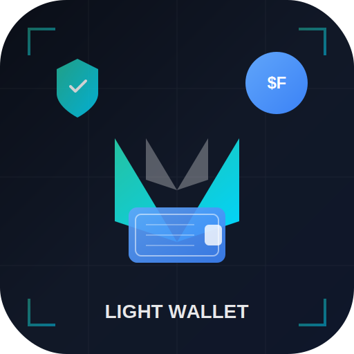

# BEAM Light Wallet

<p align="center">
  
</p>

<p align="center">
  <strong>The First and Only Fully Decentralized Light Wallet for BEAM Privacy Blockchain</strong>
</p>

<p align="center">
  <a href="#quick-install">Quick Install</a> •
  <a href="#features">Features</a> •
  <a href="#usage">Usage</a> •
  <a href="#secure-remote-access-mobile--anywhere">Remote Access</a> •
  <a href="#donate">Donate</a>
</p>

---

**Developed by [@vsnation](https://github.com/vsnation)**

**Donations:** `e17cc06481d9ae88e1e0181efee407fa8c36a861b9df723845eddc8fb1ba552048`

---

## Quick Install

### 🍎 macOS / 🐧 Linux

```bash
git clone https://github.com/vsnation/Beam-Light-Wallet.git
cd Beam-Light-Wallet
./install.sh
```

**To run again later:** Just run `./install.sh` again - it skips downloads if binaries exist.

Or download DMG from [Releases](https://github.com/vsnation/Beam-Light-Wallet/releases) (macOS).

### 🪟 Windows

```powershell
git clone https://github.com/vsnation/Beam-Light-Wallet.git
cd Beam-Light-Wallet
.\build\windows\install.bat
```

Or download from [Releases](https://github.com/vsnation/Beam-Light-Wallet/releases).

---

## Features

- **🚀 One-Click Launch** - Downloads binaries automatically, starts in seconds
- **🔒 Fully Decentralized** - No backend servers, direct blockchain connection
- **👛 Multi-Wallet Support** - Create and manage multiple wallets
- **🔐 Full Privacy** - MimbleWimble + Confidential Transactions + Dandelion++
- **💸 Send & Receive** - BEAM and all Confidential Assets
- **📈 DEX Trading** - Built-in Uniswap-style AMM DEX
- **📱 Mobile Access** - Access from any device on your network
- **🎨 Beautiful UI** - Modern dark theme, intuitive design

---

## Manual Installation

### 1. Clone Repository

```bash
git clone https://github.com/vsnation/Beam-Light-Wallet.git
cd Beam-Light-Wallet
```

### 2. Download BEAM Binaries

**macOS:**
```bash
mkdir -p binaries/macos && cd binaries/macos
curl -LO https://github.com/BeamMW/beam/releases/download/beam-7.5.13882/mac-wallet-api-7.5.13882.tar.gz
curl -LO https://github.com/BeamMW/beam/releases/download/beam-7.5.13882/mac-beam-wallet-cli-7.5.13882.tar.gz
tar -xzf *.tar.gz && chmod +x wallet-api beam-wallet
cd ../..
```

**Linux:**
```bash
mkdir -p binaries/linux && cd binaries/linux
curl -LO https://github.com/BeamMW/beam/releases/download/beam-7.5.13882/linux-wallet-api-7.5.13882.tar.gz
curl -LO https://github.com/BeamMW/beam/releases/download/beam-7.5.13882/linux-beam-wallet-cli-7.5.13882.tar.gz
tar -xzf *.tar.gz && chmod +x wallet-api beam-wallet
cd ../..
```

**Windows (PowerShell):**
```powershell
New-Item -ItemType Directory -Force -Path "binaries\windows"
cd binaries\windows
Invoke-WebRequest -Uri "https://github.com/BeamMW/beam/releases/download/beam-7.5.13882/windows-wallet-api-7.5.13882.zip" -OutFile "wallet-api.zip"
Invoke-WebRequest -Uri "https://github.com/BeamMW/beam/releases/download/beam-7.5.13882/windows-beam-wallet-cli-7.5.13882.zip" -OutFile "beam-wallet.zip"
Expand-Archive -Path "*.zip" -DestinationPath "." -Force
cd ..\..
```

### 3. Start the Wallet

```bash
python3 serve.py 9080
```

### 4. Open in Browser

```
http://127.0.0.1:9080
```

---

## Usage

### Create a New Wallet

1. Click **"Create New"**
2. Enter wallet name and password
3. **WRITE DOWN** your 12-word seed phrase
4. Confirm and start using your wallet

### Restore a Wallet

1. Click **"Restore"**
2. Enter your 12-word seed phrase
3. Set a new password
4. Wallet will sync automatically

### Send BEAM

1. Go to **Send** tab
2. Enter recipient address and amount
3. Click **Send** and confirm

### DEX Trading

1. Go to **DEX** tab
2. Select tokens to swap
3. Enter amount (quote updates automatically)
4. Click **Swap** to execute

---

## Project Structure

```
Beam-Light-Wallet/
├── serve.py                # Main HTTP server
├── install.sh              # Cross-platform installer
├── src/                    # Web interface
│   ├── index.html          # Main application
│   ├── css/                # Stylesheets
│   └── js/                 # JavaScript
├── config/                 # Configuration files
├── binaries/               # BEAM binaries (gitignored)
│   ├── linux/
│   ├── macos/
│   └── windows/
├── wallets/                # Wallet databases (gitignored)
├── logs/                   # Log files (gitignored)
├── build/                  # Build scripts
│   ├── create-dmg.sh       # macOS DMG builder
│   ├── linux/              # Linux installers
│   └── windows/            # Windows installers
└── tests/                  # Test scripts
```

---

## Security

- **No Backend Servers** - All data stored locally
- **Password Encrypted** - Wallets protected with user password
- **12-Word Seed Phrase** - Standard BIP39 recovery
- **Local API Only** - wallet-api binds to 127.0.0.1
- **Auto-Lock** - Configurable timeout

### ⚠️ Important

- **NEVER** share your seed phrase with anyone
- **NEVER** expose port 9080 to the internet without authentication
- **ALWAYS** backup your seed phrase in multiple secure locations

---

## Configuration

### Public Nodes

| Region | Address |
|--------|---------|
| EU | `eu-node01.mainnet.beam.mw:8100` |
| EU | `eu-node02.mainnet.beam.mw:8100` |
| US | `us-node01.mainnet.beam.mw:8100` |
| US | `us-node02.mainnet.beam.mw:8100` |
| Asia | `ap-node01.mainnet.beam.mw:8100` |

### Ports

| Service | Port | Description |
|---------|------|-------------|
| Web UI | 9080 | Wallet web interface |
| wallet-api | 10000 | JSON-RPC API |
| beam-node | 10005 | Local node (optional) |

---

## Secure Remote Access (Mobile & Anywhere)

Access your wallet securely from your phone or any device, anywhere in the world.

> ⚠️ **NEVER expose port 9080 directly to the internet!** Always use one of the secure methods below.

### Method 1: Tailscale (Easiest - Recommended)

Tailscale creates a private VPN network between your devices. Zero configuration, works through firewalls.

**Step 1: Install Tailscale on your PC (where wallet runs)**

```bash
# macOS
brew install tailscale
sudo tailscaled &
tailscale up

# Linux (Ubuntu/Debian)
curl -fsSL https://tailscale.com/install.sh | sh
sudo tailscale up

# Windows
# Download from https://tailscale.com/download/windows
```

**Step 2: Install Tailscale on your phone**
- iOS: [App Store](https://apps.apple.com/app/tailscale/id1470499037)
- Android: [Google Play](https://play.google.com/store/apps/details?id=com.tailscale.ipn)

**Step 3: Sign in with same account on both devices**

**Step 4: Get your PC's Tailscale IP**
```bash
tailscale ip -4
# Example output: 100.64.0.1
```

**Step 5: Access from phone**
```
http://100.64.0.1:9080
```

✅ **Done!** Your wallet is now securely accessible from anywhere.

---

### Method 2: SSH Tunnel (Most Secure)

Creates an encrypted tunnel from your device to your PC. Requires SSH server on your PC.

**Step 1: Enable SSH on your PC**

```bash
# macOS - Enable in System Preferences → Sharing → Remote Login

# Linux
sudo apt install openssh-server
sudo systemctl enable ssh
sudo systemctl start ssh

# Windows - Enable OpenSSH in Settings → Apps → Optional Features
```

**Step 2: Note your PC's IP address**
```bash
# Local network IP
ifconfig | grep "inet " | grep -v 127.0.0.1
# or
hostname -I
```

**Step 3: From your phone/laptop, create SSH tunnel**

Using Termius (iOS/Android) or any SSH client:
```bash
ssh -L 9080:127.0.0.1:9080 username@your-pc-ip
```

**Step 4: Open browser on your device**
```
http://127.0.0.1:9080
```

**For permanent access from outside your home:**
1. Set up port forwarding for SSH (port 22) on your router
2. Use your public IP or set up Dynamic DNS (e.g., noip.com)

---

### Method 3: WireGuard VPN (Advanced, Very Secure)

WireGuard is a fast, modern VPN. More setup than Tailscale but fully self-hosted.

**Step 1: Install WireGuard on your PC**

```bash
# macOS
brew install wireguard-tools

# Linux
sudo apt install wireguard

# Windows
# Download from https://wireguard.com/install/
```

**Step 2: Generate keys on PC (server)**

```bash
cd /etc/wireguard
umask 077
wg genkey | tee server_private.key | wg pubkey > server_public.key
```

**Step 3: Create server config `/etc/wireguard/wg0.conf`**

```ini
[Interface]
PrivateKey = <contents of server_private.key>
Address = 10.0.0.1/24
ListenPort = 51820

[Peer]
# Your phone
PublicKey = <phone's public key - generate in WireGuard app>
AllowedIPs = 10.0.0.2/32
```

**Step 4: Start WireGuard**

```bash
sudo wg-quick up wg0
sudo systemctl enable wg-quick@wg0  # Auto-start on boot
```

**Step 5: Configure phone**

1. Install WireGuard app on phone
2. Create new tunnel with these settings:
   - Interface Private Key: (generate in app)
   - Interface Address: `10.0.0.2/24`
   - Peer Public Key: `<contents of server_public.key>`
   - Peer Endpoint: `your-public-ip:51820`
   - Allowed IPs: `10.0.0.1/32`

**Step 6: Port forward UDP 51820 on your router**

**Step 7: Connect and access wallet**
```
http://10.0.0.1:9080
```

---

### Method 4: Cloudflare Tunnel (Zero Trust, No Port Forwarding)

Access without opening any ports. Requires Cloudflare account (free).

**Step 1: Install cloudflared**

```bash
# macOS
brew install cloudflare/cloudflare/cloudflared

# Linux
curl -L --output cloudflared.deb https://github.com/cloudflare/cloudflared/releases/latest/download/cloudflared-linux-amd64.deb
sudo dpkg -i cloudflared.deb
```

**Step 2: Authenticate**

```bash
cloudflared tunnel login
```

**Step 3: Create tunnel**

```bash
cloudflared tunnel create beam-wallet
```

**Step 4: Configure tunnel (`~/.cloudflared/config.yml`)**

```yaml
tunnel: beam-wallet
credentials-file: /path/to/credentials.json

ingress:
  - hostname: wallet.yourdomain.com
    service: http://127.0.0.1:9080
  - service: http_status:404
```

**Step 5: Add DNS record in Cloudflare dashboard**

```bash
cloudflared tunnel route dns beam-wallet wallet.yourdomain.com
```

**Step 6: Start tunnel**

```bash
cloudflared tunnel run beam-wallet
```

**Step 7: Add authentication (Cloudflare Access)**

1. Go to Cloudflare Zero Trust dashboard
2. Create Access Application for `wallet.yourdomain.com`
3. Add authentication policy (email OTP, Google, etc.)

**Step 8: Access from anywhere**
```
https://wallet.yourdomain.com
```

---

### Security Comparison

| Method | Difficulty | Security | Port Forwarding | Best For |
|--------|------------|----------|-----------------|----------|
| **Tailscale** | Easy | High | No | Most users |
| **SSH Tunnel** | Medium | Very High | Yes (SSH only) | Tech-savvy users |
| **WireGuard** | Hard | Very High | Yes (UDP) | Self-hosters |
| **Cloudflare** | Medium | Very High | No | Custom domains |

### Quick Recommendation

- **Just want it to work?** → Use **Tailscale** (5 min setup)
- **Already have SSH?** → Use **SSH Tunnel**
- **Want full control?** → Use **WireGuard**
- **Have a domain?** → Use **Cloudflare Tunnel**

---

## Troubleshooting

### Wallet won't start

```bash
# Check if port is in use
lsof -i :9080

# Kill existing process
pkill -f serve.py
```

### Balance shows zero after restore

- Wait for blockchain sync to complete
- Go to Settings → Rescan if needed

### DEX not working

DEX requires local node with shader support. Public nodes don't support DEX operations.

---

## Development

### Running Tests

```bash
./tests/test_launch.sh
```

### Building macOS DMG

```bash
./build/create-dmg.sh
```

---

## Version

- **Wallet Version:** 1.0.5
- **BEAM Binaries:** 7.5.13882

### What's New in v1.0.5

- **Airdrop System** - Create and share redeemable voucher codes for any token
- **Fuddle Game** - On-chain Wordle with BEAM/FOMO/BEAMX tournament prizes
- **Built-in Explorer** - Browse blocks, assets, contracts, DEX trades
- **P2P Marketplace** - Escrow-protected fiat-to-crypto trading with trust scores
- **Improved Dashboard** - Better balance breakdown and asset display
- **New App Store Page** - Quick access to DEX, P2P, Airdrop, Explorer, Fuddle

### Previous: v1.0.3

- Improved UI, better error messages, auto-switch to local node
- Protected settings, cleaner password errors, hidden scrollbars
- Consistent folder naming across platforms

---

## Donate

If you find this wallet useful, please consider donating:

**BEAM Address:**
```
e17cc06481d9ae88e1e0181efee407fa8c36a861b9df723845eddc8fb1ba552048
```

---

## License

MIT License - See [LICENSE](LICENSE)

---

## Links

- [BEAM Website](https://beam.mw)
- [BEAM GitHub](https://github.com/BeamMW)
- [BEAM Explorer](https://explorer.beam.mw)
- [Developer: @vsnation](https://github.com/vsnation)

---

<p align="center">
  Made with ❤️ by <a href="https://github.com/vsnation">@vsnation</a>
</p>
