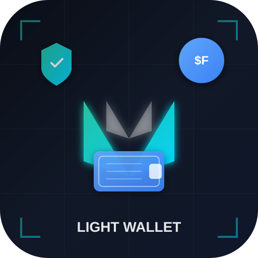

# BEAM Light Wallet

<p align="center">
  
</p>

<p align="center">
  <strong>The First and Only Fully Decentralized Light Wallet for BEAM Privacy Blockchain</strong>
</p>

<p align="center">
  <a href="#quick-install">Quick Install</a> •
  <a href="#features">Features</a> •
  <a href="#usage">Usage</a> •
  <a href="#secure-remote-access-mobile--anywhere">Remote Access</a> •
  <a href="#donate">Donate</a>
</p>

---

**Developed by [@vsnation](https://github.com/vsnation)**

**Donations:** `e17cc06481d9ae88e1e0181efee407fa8c36a861b9df723845eddc8fb1ba552048`

---


## Quick Install

**Which platforms follow mainnet today**

| Platform | BEAM binaries | Follows mainnet past HF6 |
|----------|---------------|--------------------------|
| 🐧 Linux | upstream HF6 hotfix build | Yes |
| 🪟 Windows | upstream HF6 hotfix build | Yes |
| 🍎 macOS | last macOS build BeamMW ever published (2024-05-25) | **No** |

Every version number, release asset name and binary checksum lives in
[`config/binaries.json`](config/binaries.json). That file is the single source of truth —
the launchers, `serve.py` and this README all read it, and none of them restate it.

### 🍎 macOS

> ⚠️ **A macOS install cannot follow mainnet.** BeamMW has never published a macOS build
> of the HF6 hotfix; the newest macOS binaries that exist upstream stall one block before
> the fork height (`min_consensus_height` in the manifest) and never recover.
>
> What still works: unlock, addresses, and a balance and transaction history — **frozen at
> the fork**. What does not: seeing anything received since the fork, a correct balance,
> current contract/DEX state, or getting a send confirmed (it is signed against a stale tip
> under pre-fork rules). Use Linux or Windows until a macOS build of the HF6 tag exists.

```bash
git clone https://github.com/vsnation/Beam-Light-Wallet.git
cd Beam-Light-Wallet
./start-macos.sh
```

Or download DMG from [Releases](https://github.com/vsnation/Beam-Light-Wallet/releases).

### 🐧 Linux

```bash
git clone https://github.com/vsnation/Beam-Light-Wallet.git
cd Beam-Light-Wallet
./start-linux.sh
```

**To run again later:** Just run `./start-linux.sh` again - it skips downloads if binaries exist.

### 🪟 Windows

```powershell
git clone https://github.com/vsnation/Beam-Light-Wallet.git
cd Beam-Light-Wallet
.\build\windows\start.bat
```

Or download from [Releases](https://github.com/vsnation/Beam-Light-Wallet/releases).

---

## Features

- **🚀 One-Click Launch** - Downloads binaries automatically, starts in seconds
- **🔒 Fully Decentralized** - No backend servers, direct blockchain connection
- **👛 Multi-Wallet Support** - Create and manage multiple wallets
- **🔐 Full Privacy** - MimbleWimble + Confidential Transactions + Dandelion++
- **💸 Send & Receive** - BEAM and all Confidential Assets
- **📈 DEX Trading** - Built-in Uniswap-style AMM DEX
- **📱 Mobile Access** - Access from any device on your network
- **🎨 Beautiful UI** - Modern dark theme, intuitive design

---

## Manual Installation

### 1. Clone Repository

```bash
git clone https://github.com/vsnation/Beam-Light-Wallet.git
cd Beam-Light-Wallet
```

### 2. Download BEAM Binaries

The launchers (`start-macos.sh`, `start-linux.sh`, `build\windows\start.bat`) already do
everything in this section — resolve the URLs, download, extract, and verify the checksum.
You only need these steps if you are installing by hand.

Do not type a version or an asset name. Read them out of the manifest:

```bash
cd Beam-Light-Wallet
PLATFORM=linux        # linux | macos | windows

python3 - "$PLATFORM" > binaries.list <<'PY'
import json, sys
m = json.load(open("config/binaries.json"))
p = m["platforms"][sys.argv[1]]
base = "%s/beam-%s" % (m["release_base"], p["beam_version"])
for name, b in p["binaries"].items():
    # name  url  pinned-sha256-or-dash  extracted-filename
    print(name, "%s/%s" % (base, b["asset"]), b.get("sha256") or "-", b.get("file", name))
PY
cat binaries.list
```

Then fetch and verify each one:

```bash
# serve.py and the launchers resolve binaries under the data directory, not the
# checkout: $BEAM_DATA_DIR if set, otherwise ~/.beam-light-wallet. Downloading into
# the repo instead leaves the wallet reporting that no binaries are installed.
DEST="${BEAM_DATA_DIR:-$HOME/.beam-light-wallet}/binaries/$PLATFORM"
mkdir -p "$DEST"

# Linux ships sha256sum, macOS ships shasum. The launchers pick the same way.
sha256_of() {
    if command -v sha256sum > /dev/null 2>&1; then
        sha256sum "$1" | awk '{print $1}'
    else
        shasum -a 256 "$1" | awk '{print $1}'
    fi
}
command -v sha256sum > /dev/null 2>&1 || command -v shasum > /dev/null 2>&1 || \
    echo "WARNING: neither sha256sum nor shasum is installed - install one first, or nothing below is verified"

while read -r name url sha file; do
    curl -fL "$url" -o "$DEST/$name.zip" || { echo "download failed: $url"; break; }
    unzip -o "$DEST/$name.zip" -d "$DEST" && rm -f "$DEST/$name.zip"
    # Linux and macOS assets are a .zip wrapping a .tar; Windows ships the .exe directly
    [ -f "$DEST/$name.tar" ] && tar -xf "$DEST/$name.tar" -C "$DEST" && rm -f "$DEST/$name.tar"
    chmod +x "$DEST/$file" 2>/dev/null

    have=$(sha256_of "$DEST/$file" 2>/dev/null)
    if [ "$sha" = "-" ]; then
        echo "WARNING: no pinned hash for $file - nothing was verified"
    elif [ "$have" = "$sha" ]; then
        echo "$file sha256 verified"
    else
        echo "CHECKSUM MISMATCH: $file - do not run it"
        echo "  expected (config/binaries.json): $sha"
        echo "  got:                             ${have:-<not extracted, or no hash tool>}"
        rm -f "$DEST/$file"
        break
    fi
done < binaries.list
rm -f binaries.list
```

Notes on what the old instructions got wrong, so you do not reintroduce it:

- The release publishes **`.zip`**, not `.tar.gz`. The Linux and macOS zips contain a `.tar`
  that has to be unpacked a second time.
- Windows assets are prefixed **`win-`**, not `windows-`. `windows-wallet-api-*.zip` is a 404.
- `curl -f` matters. Without it a 404 is written to disk as an HTML error page and the failure
  only surfaces later as a confusing unzip error.
- The archives also ship a `*-checksum.txt`. It is a useful secondary check, but it comes from
  the same place as the binary; the hash pinned in `config/binaries.json` is authoritative.
- macOS entries currently carry **no pinned hash**, so the loop above verifies nothing there.
  That is one more reason macOS is not a supported install today (see [Quick Install](#quick-install)).

On Windows, run the loop under Git Bash or WSL, or just use `build\windows\start.bat`, which
does the same thing in native batch.

### 3. Start the Wallet

```bash
python3 serve.py 9080
```

### 4. Open in Browser

```
http://127.0.0.1:9080
```

---

## Usage

### Create a New Wallet

1. Click **"Create New"**
2. Enter wallet name and password
3. **WRITE DOWN** your 12-word seed phrase
4. Confirm and start using your wallet

### Restore a Wallet

1. Click **"Restore"**
2. Enter your 12-word seed phrase
3. Set a new password
4. Wallet will sync automatically

### Send BEAM

1. Go to **Send** tab
2. Enter recipient address and amount
3. Click **Send** and confirm

### DEX Trading

1. Go to **DEX** tab
2. Select tokens to swap
3. Enter amount (quote updates automatically)
4. Click **Swap** to execute

---

## Project Structure

```
Beam-Light-Wallet/
├── serve.py                # Main HTTP server
├── start.sh                # Cross-platform launcher
├── start-macos.sh          # macOS launcher
├── start-linux.sh          # Linux launcher
├── start-windows.sh        # Windows launcher (WSL/Git Bash)
├── src/                    # Web interface
│   ├── index.html          # Main application
│   ├── css/                # Stylesheets
│   └── js/                 # JavaScript
├── config/                 # Configuration files
│   └── binaries.json       # Versions, release assets, pinned checksums (source of truth)
├── build/                  # Build scripts
│   ├── macos/              # macOS DMG builder (create-dmg.sh)
│   ├── linux/              # Linux installers
│   └── windows/            # Windows installers
└── tests/                  # Test scripts
```

Nothing writable lives in the checkout. BEAM binaries, wallet databases, logs and node data
are all kept under `~/.beam-light-wallet/` (override with `BEAM_DATA_DIR`), so a packaged or
read-only install works unchanged:

```
~/.beam-light-wallet/
├── binaries/<platform>/    # wallet-api, beam-wallet, beam-node
├── wallets/<name>/         # wallet.db
├── logs/
└── node_data/
```

---

## Security

- **No Backend Servers** - All data stored locally
- **Password Encrypted** - Wallets protected with user password
- **12-Word Seed Phrase** - Standard BIP39 recovery
- **Local API Only** - wallet-api binds to 127.0.0.1
- **Auto-Lock** - Configurable timeout

### ⚠️ Important

- **NEVER** share your seed phrase with anyone
- **NEVER** expose port 9080 to the internet without authentication
- **ALWAYS** backup your seed phrase in multiple secure locations

---

## Configuration

### Public Nodes

| Region | Address |
|--------|---------|
| EU | `eu-node01.mainnet.beam.mw:8100` |
| EU | `eu-node02.mainnet.beam.mw:8100` |
| US | `us-node01.mainnet.beam.mw:8100` |
| US | `us-node02.mainnet.beam.mw:8100` |
| Asia | `ap-node01.mainnet.beam.mw:8100` |

### Ports

| Service | Port | Description |
|---------|------|-------------|
| Web UI | 9080 | Wallet web interface |
| wallet-api | 10000 | JSON-RPC API |
| beam-node | 10005 | Local node (optional) |

---

## Secure Remote Access (Mobile & Anywhere)

> **The wallet listens on `127.0.0.1` only, and refuses any request whose `Host`
> header is not a loopback name.** That is deliberate — it is what stops
> DNS-rebinding attacks and stops anyone on your Wi‑Fi reaching your funds.
>
> It also means you cannot browse to `http://<your-tailscale-ip>:9080` and have
> it work. Nothing is listening there. **Do not "fix" that by making the wallet
> listen on `0.0.0.0`** — that hands your balance, your addresses and your
> spending API to every device on the network.

Your phone is only a screen. Keys, seed phrase and `wallet.db` never leave your
computer, so a lost phone loses nothing.

The setup that works, and is free:

1. **Tailscale** on computer and phone — a private network between your own
   devices, nothing exposed to the internet.
2. **An SSH tunnel** over it, mapping **port 9080 to port 9080**:

```bash
ssh -N -L 9080:127.0.0.1:9080 you@my-machine.tailnet-1234.ts.net
```

3. Open **`http://localhost:9080`** on the phone.

The port must be 9080 at *both* ends. Forward 9081 to 9080 and your browser
sends `Host: localhost:9081`, which the wallet rejects with `Invalid Host
header`.

**Full walkthrough — free SSH apps for iOS and Android, key-only login, what
never to do and why:** **[docs/MOBILE_ACCESS.md](docs/MOBILE_ACCESS.md)**

---


## Troubleshooting

### Wallet won't start

```bash
# Check if port is in use
lsof -i :9080

# Kill existing process
pkill -f serve.py
```

### Balance shows zero after restore

- Wait for blockchain sync to complete
- Go to Settings → Rescan if needed

### Balance and history are frozen at an old date (macOS)

Not a sync problem, and a rescan will not fix it. The macOS binaries pinned in
`config/binaries.json` predate HF6 and stop one block before the fork height, so the wallet
holds a correct-looking view of a chain that stopped moving. Confirm it:

```bash
python3 -c "import json;m=json.load(open('config/binaries.json'));print(m['platforms']['macos']['hf6_compatible'], m['min_consensus_height'])"
curl -s https://explorer.0xmx.net/api/status    # compare the real tip against your height
```

There is no workaround inside this wallet. Use Linux or Windows, whose manifest entries are
on an HF6-capable build.

### Download fails with "checksum mismatch"

The extracted binary does not match the hash pinned in `config/binaries.json`. Delete
`~/.beam-light-wallet/binaries/<platform>/` and retry; if it happens again, do not run the
binary — the manifest is pinned against BeamMW's published checksums, so a repeatable mismatch
means the asset changed.

### DEX not working

A local node is **not** required. `serve.py` injects the shader from `shaders/` into every
`invoke_contract` call, so the client supplies the contract code and a public node only has to
serve state.

If swaps still fail, check the sync badge first — a wallet that is out of consensus refuses to
sign sends and swaps by design (on macOS this is expected, see [Quick Install](#quick-install)).

---

## Development

### Running Tests

```bash
./tests/test_launch.sh
```

### Building macOS DMG

```bash
./build/macos/create-dmg.sh
```

The DMG is named from `app_version` in `config/binaries.json`. Bump the version there and
nowhere else — `serve.py`, the installers and the DMG name all read that field.

### Upgrading the BEAM binaries

Edit the platform's `beam_version`, `asset` and `sha256` in `config/binaries.json` and nothing
else. Delete `~/.beam-light-wallet/binaries/<platform>/` (or `$BEAM_DATA_DIR/binaries/<platform>/`
if you set that) so the next launch re-downloads and re-verifies against the new hash.

Get the hash from the checksum file BeamMW publishes beside the asset, or compute it from the
extracted binary:

```bash
# sha256sum on Linux, shasum -a 256 on macOS
sha256sum ~/.beam-light-wallet/binaries/linux/wallet-api
```

---

## Version

Version numbers are not restated here — they live in
[`config/binaries.json`](config/binaries.json):

| Field | What it is |
|-------|------------|
| `app_version` | Wallet version. `serve.py` reads it and serves it at `GET /api/status`. |
| `platforms.<os>.beam_version` | BEAM binaries pinned for that OS. |
| `platforms.<os>.hf6_compatible` | Whether that build can follow mainnet past the fork. |
| `platforms.<os>.binaries.<name>.asset` / `.sha256` | Release asset name and pinned hash of the extracted binary. |
| `hardfork.min_beam_version` | Oldest BEAM build that can cross HF6. |
| `min_consensus_height` | HF6 activation block. |

Check what you are running:

```bash
python3 -m json.tool config/binaries.json          # what this checkout pins
curl -s http://127.0.0.1:9080/api/status           # what the running wallet reports
```

### What's New in v1.1.0

- **One version manifest** - `config/binaries.json` replaces the BEAM version that was
  hardcoded in thirteen files and the app version that disagreed with itself four ways
- **Verified downloads** - every extracted binary is checked against a SHA-256 pinned in the
  manifest; a mismatch aborts the install instead of running the binary
- **Correct Windows asset names** - the installers that requested `windows-*.zip` were
  downloading a 404; the real assets are `win-*`
- **Honest sync state** - sync is derived from `is_in_sync`, block age and an independent
  explorer height, not from a hardcoded threshold; a stale wallet says so in red and refuses
  to sign sends and swaps
- **macOS HF6 status surfaced** - the wallet no longer reports healthy mainnet sync while
  stalled at the fork
- **Local node is opt-in** - unlock, create and restore no longer start `beam-node` (a ~9 GB
  download) in the background, and nothing auto-migrates the wallet onto it
- **Localhost API locked down** - the JSON-RPC proxy no longer answers cross-origin requests,
  and mutations require a per-run token a cross-origin page cannot read

### Previous: v1.0.5

- **Airdrop System** - Create and share redeemable voucher codes for any token
- **Fuddle Game** - On-chain Wordle with BEAM/FOMO/BEAMX tournament prizes (updated contract with RNG fix)
- **Built-in Explorer** - Browse blocks, assets, contracts, DEX trades
- **P2P Marketplace** - Escrow-protected fiat-to-crypto trading with trust scores
- **Improved Dashboard** - Better balance breakdown and asset display
- **New App Store Page** - Quick access to DEX, P2P, Airdrop, Explorer, Fuddle
- **Renamed Launchers** - Platform-specific start scripts (start-macos.sh, start-linux.sh, start-windows.sh)

### Previous: v1.0.3

- Improved UI, better error messages, auto-switch to local node
- Protected settings, cleaner password errors, hidden scrollbars
- Consistent folder naming across platforms

---

## Donate

If you find this wallet useful, please consider donating:

**BEAM Address:**
```
e17cc06481d9ae88e1e0181efee407fa8c36a861b9df723845eddc8fb1ba552048
```

---

## License

MIT License - See [LICENSE](LICENSE)

---

## Links

- [BEAM Website](https://beam.mw)
- [BEAM GitHub](https://github.com/BeamMW)
- [BEAM Explorer](https://explorer.beam.mw)
- [Developer: @vsnation](https://github.com/vsnation)

---

<p align="center">
  Made with ❤️ by <a href="https://github.com/vsnation">@vsnation</a>
</p>
